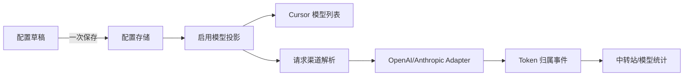
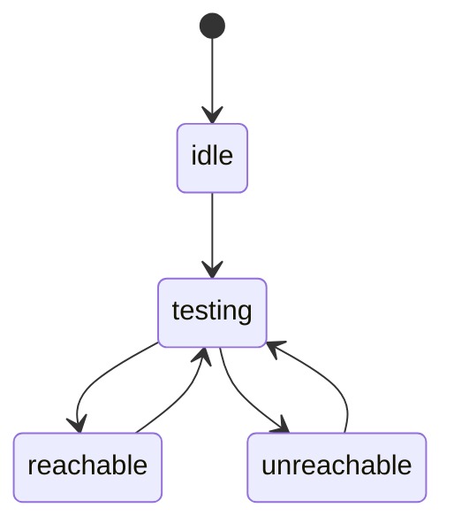
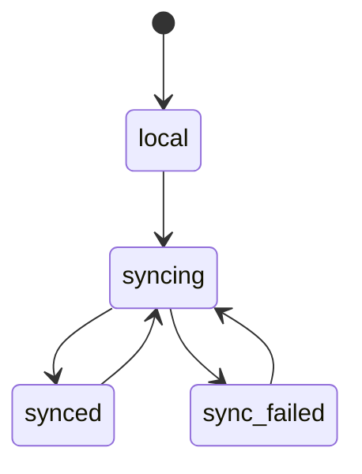

# 模型中转站配置重构开发文档

## 1. 目标

将当前“每个模型重复保存 URL、API Key”的扁平配置改为两层结构：

- `ProviderConfig`：中转站及共享鉴权、协议、模型发现配置。
- `ProviderModelConfig`：中转站下的模型、启用状态和模型级请求参数。

运行时只消费“已启用模型投影”，配置编辑、模型发现、测试和用量统计不直接操作运行时渠道。

## 2. 领域模型

```yaml
schemaVersion: 2
providers:
  - id: provider_<stable-id>
    name: 示例中转站
    type: openai
    baseURL: https://example.com/v1
    apiKey: sk-xxx
    discoveryPath: /models
    customHeadersEnabled: false
    customHeadersJSON: '{}'
    models:
      - id: model_<stable-id>
        modelID: gpt-5.5
        displayName: GPT 5.5
        enabled: true
        available: true
        legacyChannelIDs: []
        openAIEndpoint: /v1/responses
        reasoningEffort: medium
        contextWindowTokens: 200000
        maxCompletionTokens: 65536
```

### 字段职责

| 归属 | 字段 |
| --- | --- |
| 中转站 | `id/name/type/baseURL/apiKey/discoveryPath/customHeaders*` |
| 模型 | `id/modelID/displayName/enabled/available/legacyChannelIDs` |
| 模型请求覆盖 | `openAIEndpoint/reasoningEffort/extraParams/contextWindowTokens/maxTokens/thinking*` |
| 运行时派生 | `channelID/providerID/modelConfigID/resolved URL/headers` |

约束：

1. `provider.id` 与 `model.id` 一经持久化不随名称、Key、URL 改变。
2. `channelID` 由稳定的 provider/model ID 组合生成，不使用密钥。
3. 同一中转站内 `modelID` 唯一；不同中转站允许相同 `modelID`。
4. Cursor 模型列表只展示 `enabled=true` 的模型，并按 `channelID` 去重。
5. 模型发现失败或模型暂时消失时，不删除本地配置；只更新 `available`。

## 3. 数据流



`Projector` 是纯函数：输入规范化配置，输出兼容现有 provider adapter 的 `ModelAdapterConfig`。前端不得自行展开多行模型字符串。

## 4. 状态机

### 中转站连接状态



### 模型同步状态



### 模型状态

模型状态由两个正交字段组成：

- `available`：最近一次发现结果是否包含该模型。
- `enabled`：是否投影到 Cursor。

因此已启用但暂不可发现的模型仍保留配置和历史统计，界面显示警告，不自动禁用。

## 5. 服务 API

### `FetchProviderModels(provider)`

- 默认发现地址：规范化 `baseURL + /models`；可由 `discoveryPath` 覆盖。
- OpenAI 使用 `Authorization: Bearer`；Anthropic 同时发送 `x-api-key` 和版本头。
- 支持 `{"data":[...]}`、`{"models":[...]}` 以及直接数组。
- 模型 ID 从字符串项或对象的 `id/name/model/modelID` 读取。
- 结果去空、大小写无关去重并稳定排序。
- HTTP 非 2xx、超时、无效 JSON、无模型均返回可展示错误，不改变已保存配置。

### `TestProviderConnectivity(provider)`

执行模型发现请求并返回耗时、HTTP 状态、模型数量和错误摘要，不发起推理请求。

### `TestProviderModel(provider, model)`

把两层配置投影为临时渠道，复用现有流式测速。结果键固定为 `providerID/modelConfigID`，包含首字耗时、总耗时、输出 Token、TPS 和原始错误。

### 配置保存

保存整个 provider 快照。后端先规范化、校验并生成投影，全部成功后才原子替换配置文件；任何错误均保持旧配置和旧运行态。

## 6. 旧配置迁移

1. 仅当 `providers` 为空且存在旧 `modelAdapters` 时迁移。
2. 按 `type + normalized baseURL + apiKey + customHeaders` 分组为中转站。
3. 旧单项中的多行/逗号 `modelID` 拆成显式子模型。
4. 每个旧渠道哈希写入子模型 `legacyChannelIDs`。
5. 所有旧模型默认 `enabled=true`、`available=true`。
6. 完整规范化和校验成功后写入 schema v2；失败不覆盖原文件。
7. 新版本读取旧字段用于迁移，新保存仅写 `providers`。

运行时解析顺序：稳定 `channelID` → 唯一匹配的 `legacyChannelID` → 唯一匹配的上游 `modelID`。

## 7. Token 用量 schema

`usage.json` 保留全局 `totals/daily`，新增：

```json
{
  "by_provider": {
    "provider_id": {
      "provider_calls": 1,
      "input_tokens": 100,
      "output_tokens": 20,
      "cache_read_tokens": 0,
      "cache_write_tokens": 0,
      "total_tokens": 120
    }
  },
  "by_provider_model": {
    "provider_id/model_id": {
      "provider_id": "provider_id",
      "model_config_id": "model_id",
      "model": "gpt-5.5",
      "provider_calls": 1,
      "total_tokens": 120
    }
  }
}
```

每个新 provider call 事件记录 `provider_id/model_config_id/model`。事件更新时先回滚旧事件的全局和归属维度，再应用新事件，保证重放幂等。旧事件没有归属字段，只参与全局统计。

## 8. UI 交互

- 主界面按中转站显示 Host、掩码 Key、连接状态、已启用/已发现模型数和 Token 总量。
- “获取模型”只更新编辑草稿；用户勾选后点击“应用更改”才保存。
- 支持搜索、全选、清空、保留消失模型、单模型测速。
- 明确区分：接口可访问、模型可推理、模型已启用。
- 删除中转站前展示受影响的启用模型数；删除后历史用量仍按稳定 ID 保留。

## 9. 验收标准

1. 旧配置升级后 Cursor 模型数量和旧版有效渠道一致。
2. 一个中转站可选择启用多个模型，列表数量严格等于启用数量。
3. 同名模型位于不同中转站时均可显示和正确选路。
4. 修改名称、URL 或 API Key 后稳定渠道 ID 不变，旧会话 ID 仍能解析。
5. 获取模型失败不清空模型，模型消失不自动禁用。
6. 中转站测试与模型测试结果互不覆盖。
7. 新请求可按中转站和模型统计 input/output/cache/total Token；旧总量不丢失。
8. 配置写入、用量事件更新均具备失败回滚或幂等行为。